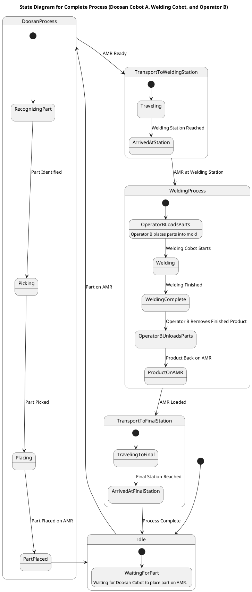

# Chapter 1 : State Diagram for Operation Process

```plantuml
@startuml

title State Diagram for Complete Process (Doosan Cobot A, Welding Cobot, and Operator B)

[*] --> Idle

state Idle {
    [*] --> WaitingForPart
    WaitingForPart : Waiting for Doosan Cobot to place part on AMR.
}

Idle --> DoosanProcess: Part on AMR

state DoosanProcess {
    [*] --> RecognizingPart
    RecognizingPart --> Picking: Part Identified
    Picking --> Placing: Part Picked
    Placing --> PartPlaced: Part Placed on AMR
    PartPlaced --> Idle
}

DoosanProcess --> TransportToWeldingStation: AMR Ready

state TransportToWeldingStation {
    [*] --> Traveling
    Traveling --> ArrivedAtStation: Welding Station Reached
}

TransportToWeldingStation --> WeldingProcess: AMR at Welding Station

state WeldingProcess {
    [*] --> OperatorBLoadsParts
    OperatorBLoadsParts: Operator B places parts into mold
    OperatorBLoadsParts --> Welding: Welding Cobot Starts
    Welding --> WeldingComplete: Welding Finished
    WeldingComplete --> OperatorBUnloadsParts: Operator B Removes Finished Product
    OperatorBUnloadsParts --> ProductOnAMR: Product Back on AMR
}

WeldingProcess --> TransportToFinalStation: AMR Loaded

state TransportToFinalStation {
    [*] --> TravelingToFinal
    TravelingToFinal --> ArrivedAtFinalStation: Final Station Reached
}

TransportToFinalStation --> Idle: Process Complete

@enduml


```

